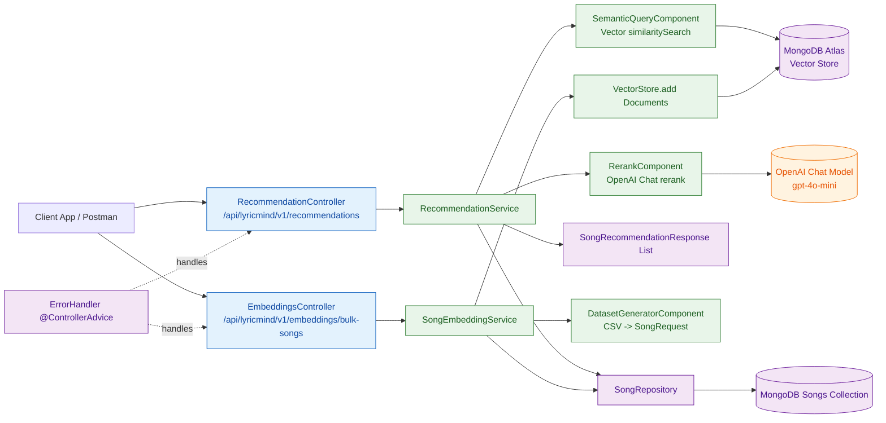
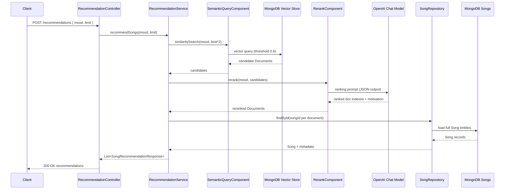
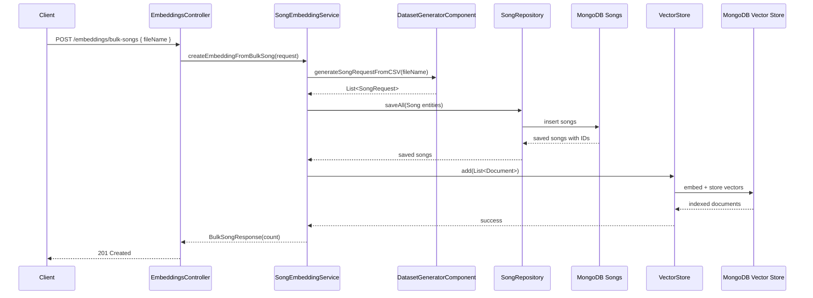

# 🎵 LyricMind - AI Mood-Based Song Recommendation

## Overview
LyricMind is a Spring Boot backend that recommends songs from lyrics using a RAG-style pipeline:
- embed songs into a MongoDB Atlas vector index
- retrieve candidates with semantic search
- rerank with an LLM for mood relevance
- return clean recommendation DTOs

## Backend High-Level Architecture

## Recommendation Flow (Runtime)

## Ingestion Flow (Bulk CSV)

## Interview Talking Points
- Two storage views: structured song data in MongoDB + semantic vectors in Atlas vector index.
- Hybrid retrieval: vector search gets relevant candidates; repository lookup fetches full song entity.
- Quality boost: LLM reranking adds better ordering and human-readable motivation.
- Resilience: rerank failures gracefully fall back to original vector ranking.
- Clear separation of concerns: controller -> service -> component -> repository/vector store.

## Tech Stack
- Spring Boot 3
- Spring AI (OpenAI model + MongoDB Atlas vector store)
- MongoDB Atlas (document + vector index)
- OpenAI Embeddings + Chat model
