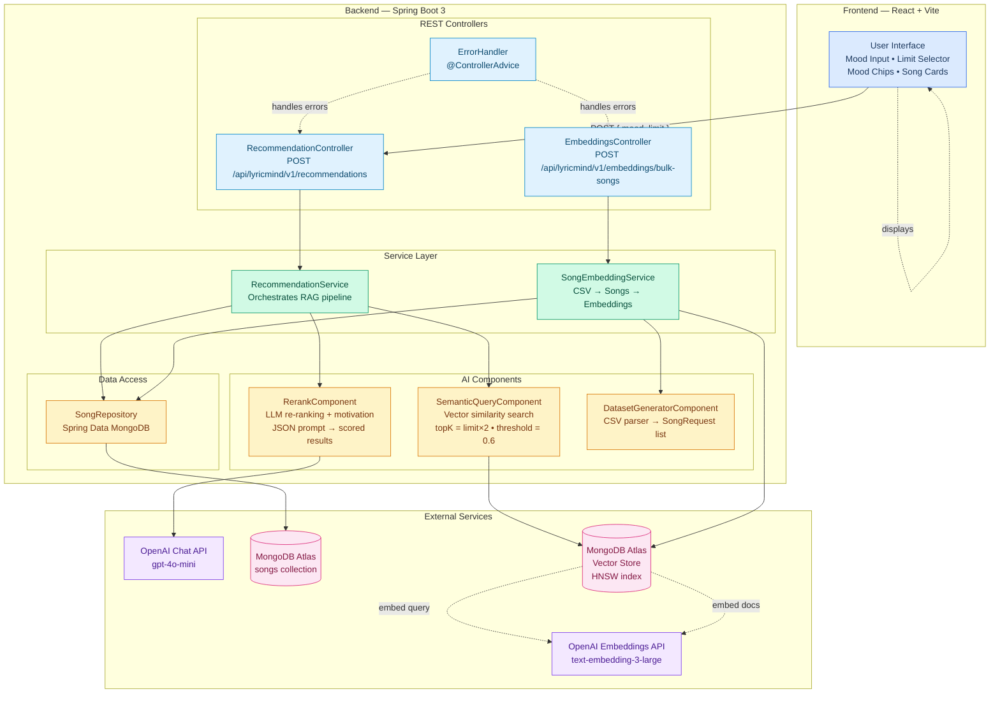
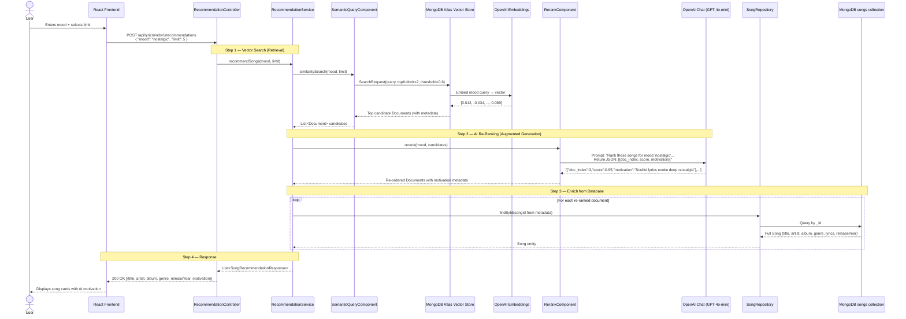

# 🎵 LyricMind — AI-Powered Mood-Based Song Recommendation

> Tell the AI how you feel and get personalized song recommendations with explanations for why each song matches your mood.

LyricMind is a full-stack application that uses **Retrieval-Augmented Generation (RAG)** to recommend songs based on natural-language mood descriptions. Songs are embedded into a vector store, retrieved via semantic similarity search, then re-ranked by an LLM that explains *why* each song fits the requested mood.

---

## ✨ Key Features

| Feature | Description |
|---|---|
| **Natural Language Mood Input** | Users describe their mood in free text (e.g., *"I feel nostalgic and want something soulful"*) or pick from preset mood chips |
| **Semantic Vector Search** | Converts mood text to embeddings and finds matching songs via cosine similarity (threshold ≥ 0.6) in MongoDB Atlas |
| **AI Re-Ranking with Motivation** | GPT-4o-mini re-ranks candidate songs by mood relevance and generates a human-readable *motivation* for each recommendation |
| **CSV Dataset Ingestion** | Pre-loaded CSV song dataset (title, artist, album, year, lyrics) is ingested and auto-embedded into the vector store via a backend API call |
| **Configurable Result Limit** | Users choose 1–10 songs per request |
| **Graceful Fallbacks** | If re-ranking fails, the system returns original vector search order instead of crashing |
| **Global Error Handling** | `@ControllerAdvice` catches all exceptions and returns clean HTTP error responses |

---

## 🏗️ System Architecture Diagram (Full Project)



---

## 🔁 RAG Pipeline Diagram (Backend Logic)



---

## 🛠️ Tech Stack

| Layer | Technology |
|---|---|
| **Frontend** | React 19, Vite 7, Vanilla CSS |
| **Backend** | Java 21, Spring Boot 3.5, Spring AI 1.1 |
| **Database** | MongoDB Atlas (document store + vector index) |
| **AI Models** | OpenAI `text-embedding-3-large` (embeddings), `gpt-4o-mini` (re-ranking) |
| **Vector Store** | MongoDB Atlas Vector Search (HNSW index, cosine similarity) |

---

## 📂 Project Structure

```
lyricmind/
├── frontend/                        # React UI
│   ├── src/
│   │   ├── App.jsx                  # Main app — routing between MoodForm / Results / Loader / Error
│   │   ├── components/
│   │   │   ├── MoodForm.jsx         # Mood text input + mood chips + limit stepper
│   │   │   ├── SongCard.jsx         # Displays title, artist, album, genre, year, motivation
│   │   │   └── Loader.jsx           # Animated loading spinner
│   │   ├── pages/
│   │   │   └── ResultPage.jsx       # Grid of SongCards with mood tag + back button
│   │   └── services/
│   │       └── api.js               # fetch POST → /api/lyricmind/v1/recommendations
│   └── package.json
│
├── backend/                         # Spring Boot API
│   ├── src/main/java/com/lyricmind/
│   │   ├── LyricmindApplication.java
│   │   ├── controller/
│   │   │   ├── RecommendationController.java   # POST /recommendations → {mood, limit}
│   │   │   ├── EmbeddingsController.java       # POST /embeddings/bulk-songs → {fileName}
│   │   │   └── ErrorHandler.java               # Global @ControllerAdvice
│   │   ├── service/
│   │   │   ├── RecommendationService.java      # RAG pipeline orchestrator
│   │   │   └── SongEmbeddingService.java       # CSV → MongoDB + vector store
│   │   ├── component/
│   │   │   ├── SemanticQueryComponent.java     # Vector similarity search
│   │   │   ├── RerankComponent.java            # LLM re-ranking with motivation
│   │   │   └── DatasetGeneratorComponent.java  # CSV file parser
│   │   ├── model/
│   │   │   ├── Song.java                       # MongoDB document entity
│   │   │   ├── SongEmbedding.java              # Vector embedding entity
│   │   │   └── dto/
│   │   │       ├── MusicRequest.java           # Input:  { mood, limit }
│   │   │       ├── SongRecommendationResponse.java  # Output: { title, artist, album, genre, releaseYear, motivation }
│   │   │       ├── BulkSongRequest.java        # Input:  { fileName }
│   │   │       └── BulkSongResponse.java       # Output: { numberOfSongs }
│   │   └── repository/
│   │       └── SongRepository.java             # Spring Data MongoDB CRUD
│   ├── src/main/resources/
│   │   ├── application.properties
│   │   └── PostMalone.csv                      # Pre-loaded song dataset
│   └── pom.xml
└── README.md
```

---

## 🚀 Getting Started

### Prerequisites

- Java 21+
- Node.js 18+ (for React frontend)
- MongoDB Atlas cluster with Vector Search index
- OpenAI API key

### 1. Start the Backend

```bash
cd backend
./mvnw spring-boot:run
```

The backend starts on `http://localhost:8080`. If port 8080 is already in use, stop the existing process first or set a custom port:

```bash
SERVER_PORT=8081 ./mvnw spring-boot:run
```

### 2. Start the Frontend

```bash
cd frontend
npm install
npm run dev
```

Open the URL shown in the terminal (e.g., `http://localhost:5173`).

---

## 🧪 Testing with curl

### Recommend songs by mood

```bash
curl -s -X POST http://localhost:8080/api/lyricmind/v1/recommendations \
  -H "Content-Type: application/json" \
  -d '{"mood": "happy and energetic", "limit": 3}' | python3 -m json.tool
```

**Expected response:**

```json
[
  {
    "title": "Congratulations",
    "artist": "Post Malone",
    "album": "Stoney",
    "genre": "Hip-Hop/Pop",
    "releaseYear": 2016,
    "motivation": "Celebratory anthem with upbeat energy matches happy mood"
  },
  {
    "title": "Sunflower",
    "artist": "Post Malone",
    "album": "Hollywood's Bleeding",
    "genre": "Pop/Hip-Hop",
    "releaseYear": 2018,
    "motivation": "Warm, feel-good melody radiates happiness and positivity"
  }
]
```

### Ingest pre-loaded song dataset (one-time setup)

This triggers the backend to read the pre-loaded `PostMalone.csv` from `src/main/resources/`, save songs to MongoDB, and generate vector embeddings.

```bash
curl -s -X POST http://localhost:8080/api/lyricmind/v1/embeddings/bulk-songs \
  -H "Content-Type: application/json" \
  -d '{"fileName": "PostMalone.csv"}' | python3 -m json.tool
```

**Expected response:**

```json
{
  "numberOfSongs": 78
}
```

### Health check

```bash
curl -s http://localhost:8080/actuator/health | python3 -m json.tool
```

---

## 📡 API Reference

### `POST /api/lyricmind/v1/recommendations`

Get AI-powered song recommendations based on mood.

| Field | Type | Required | Description |
|---|---|---|---|
| `mood` | string | ✅ | Natural language mood description |
| `limit` | integer | ❌ | Number of songs (1–10, default: 10) |

**Response:** `200 OK` — Array of:

| Field | Type | Description |
|---|---|---|
| `title` | string | Song title |
| `artist` | string | Artist name |
| `album` | string | Album name |
| `genre` | string | Music genre |
| `releaseYear` | integer | Release year |
| `motivation` | string | AI-generated explanation of why this song matches the mood |

### `POST /api/lyricmind/v1/embeddings/bulk-songs`

Ingest the pre-loaded song dataset (CSV file bundled in `src/main/resources/`) into MongoDB and the vector store. This is a **one-time setup** call — not a user-facing feature.

| Field | Type | Required | Description |
|---|---|---|---|
| `fileName` | string | ✅ | CSV filename in `src/main/resources/` |

**Response:** `201 Created` — `{ "numberOfSongs": <count> }`

---

## 🧠 How the RAG Pipeline Works

1. **User sends mood** → `"nostalgic and soulful"`
2. **Embedding** → OpenAI converts mood text to a 3072-dim vector
3. **Vector Search** → MongoDB Atlas finds songs with similar embedding vectors (cosine similarity ≥ 0.6, topK = limit × 2)
4. **Re-Ranking** → GPT-4o-mini receives candidate songs and the mood, ranks them by relevance, and writes a `motivation` for each
5. **Enrichment** → Full song details (album, genre, year) are loaded from MongoDB `songs` collection
6. **Response** → Clean JSON with title, artist, album, genre, releaseYear, and AI motivation

If re-ranking fails at step 4, the system gracefully falls back to the original vector search order.
