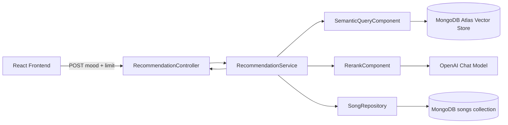

# LyricMind

AI-powered mood-based song recommendation app built with React + Spring Boot.

Users provide a mood and desired result size. The backend retrieves semantically similar songs from a vector store, re-ranks them with an LLM, and returns recommendations with reasons (`motivation`) for each song.

## What This Project Does

- Accepts natural-language mood input (for example: "nostalgic and calm")
- Supports a configurable recommendation limit (`1` to `10`)
- Uses MongoDB Atlas Vector Search for semantic retrieval
- Uses OpenAI chat model for reranking + reason generation
- Returns clean recommendation objects for frontend display
- Supports CSV-based ingestion into MongoDB + vector index

## Architecture



## Backend Flow (RAG)

1. Frontend calls `POST /api/lyricmind/v1/recommendations` with `mood` and `limit`
2. `SemanticQueryComponent` performs similarity search (`topK = limit * 2`, threshold `0.6`)
3. `RerankComponent` reorders candidates and adds `motivation`
4. `RecommendationService` loads full song details by `songId`
5. API returns `SongRecommendationResponse[]`

If reranking fails, the service falls back to original vector-search order.

## Tech Stack

- Frontend: React 19, Vite 7, CSS
- Backend: Java 21, Spring Boot 3.5, Spring AI 1.1
- Database: MongoDB Atlas (documents + vector search)
- AI models:
  - Embedding: `text-embedding-3-large`
  - Chat/rerank: `gpt-4o-mini`

## API Contracts

### 1) Get Recommendations

- Method: `POST`
- Path: `/api/lyricmind/v1/recommendations`

Request body:

```json
{
  "mood": "happy and energetic",
  "limit": 5
}
```

Response body (`200`):

```json
[
  {
    "title": "...",
    "artist": "...",
    "album": "...",
    "genre": "...",
    "releaseYear": 2019,
    "motivation": "Matches upbeat mood and lyrical tone"
  }
]
```

### 2) Bulk Song Embedding From CSV

- Method: `POST`
- Path: `/api/lyricmind/v1/embeddings/bulk-songs`

Request body:

```json
{
  "fileName": "PostMalone.csv"
}
```

Response body (`201`):

```json
{
  "numberOfSongs": 123
}
```

Note: the project includes a default CSV at `backend/src/main/resources/PostMalone.csv`.

## Local Setup

### Prerequisites

- Java 21+
- Node.js 18+
- MongoDB Atlas cluster (with network access from your machine)
- OpenAI API key

### Environment Variables (Backend)

- `SPRING_DATA_MONGODB_URI`
- `SPRING_DATA_MONGODB_DATABASE` (optional, default `lyricmind`)
- `SPRING_AI_OPENAI_API_KEY`
- `SPRING_AI_OPENAI_EMBEDDING_MODEL` (optional, default `text-embedding-3-large`)
- `SPRING_AI_OPENAI_CHAT_MODEL` (optional, default `gpt-4o-mini`)

Example:

```bash
export SPRING_DATA_MONGODB_URI='mongodb+srv://<user>:<password>@<cluster>/<db>?retryWrites=true&w=majority'
export SPRING_DATA_MONGODB_DATABASE='lyricmind'
export SPRING_AI_OPENAI_API_KEY='sk-...'
```

### Run Backend

```bash
cd backend
./mvnw spring-boot:run
```

### Run Frontend

```bash
cd frontend
npm install
npm run dev
```

By default, frontend requests `http://localhost:8080` unless `VITE_API_URL` is set.

## Quick API Test (curl)

```bash
curl -s -X POST http://localhost:8080/api/lyricmind/v1/embeddings/bulk-songs \
  -H "Content-Type: application/json" \
  -d '{"fileName":"PostMalone.csv"}'

curl -s -X POST http://localhost:8080/api/lyricmind/v1/recommendations \
  -H "Content-Type: application/json" \
  -d '{"mood":"calm and nostalgic","limit":5}'
```

## Docker (Backend)

Dockerfile location: `backend/Dockerfile`

Build and run locally:

```bash
cd backend
docker build -t lyricmind-backend .
docker run --rm -p 8080:8080 \
  -e SPRING_DATA_MONGODB_URI='mongodb+srv://<user>:<password>@<cluster>/<db>?retryWrites=true&w=majority' \
  -e SPRING_AI_OPENAI_API_KEY='sk-...' \
  lyricmind-backend
```

## Deploy on Render (Backend)

1. Push repository to GitHub
2. On Render, create a new **Web Service**
3. Choose **Docker** runtime
4. Set **Root Directory** to `backend`
5. Set **Dockerfile Path** to `Dockerfile`
6. Add env vars:
   - `SPRING_DATA_MONGODB_URI`
   - `SPRING_AI_OPENAI_API_KEY`
   - optional `SPRING_DATA_MONGODB_DATABASE=lyricmind`
7. Deploy

Health check:

```bash
curl -s https://<your-service>.onrender.com/actuator/health
```

## Troubleshooting

- `Port 8080 already in use`: stop the existing process on `8080` or run backend on another port
- MongoDB timeout / SSL internal error: verify Atlas IP allowlist and connection string credentials
- `ERR_CONNECTION_REFUSED` from frontend: backend is not running or URL/port mismatch

